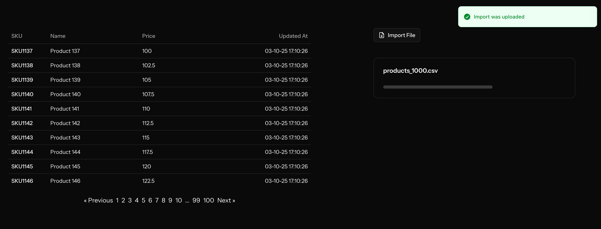
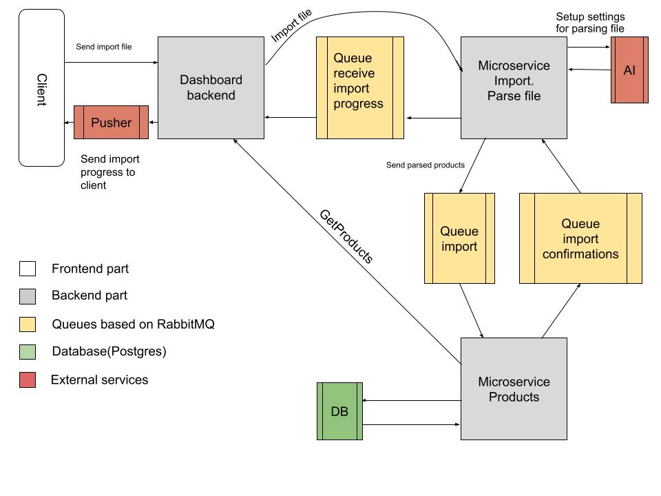

# About project
The main goal of this project is to gain experience with major web application technologies such as `microservices`, `RabbitMQ`, `Pusher`, `PostgreSQL`, `AI assistant`, `Vue`, and `Shadcn`.

The core business logic of the project is as follows:  
A user can import a `CSV` file to fill or update the product database.  
An AI assistant analyzes the file and automatically configures the correct import settings based on the file’s structure.  
The user has a simple dashboard displaying a product table and a form to upload import files.



### Business logic diagram


# Installation
### Deploy all services
```bash
bash install-with-docker.sh
```

### Setup the AI agent
Add your `GEMINI_API_KEY` to the `Import/.env` file
[Get an api key](https://aistudio.google.com/app/apikey). Its free ;)

### Setup pusher
Configure the following variables in `Admin/.env`.
[Sign up and get access](https://pusher.com/) Its free also :)
```bash
PUSHER_APP_ID=
PUSHER_APP_KEY=
PUSHER_APP_SECRET=
PUSHER_APP_CLUSTER=
PUSHER_PORT=
PUSHER_SCHEME=
```

### Optional: setup hosts
```bash
nano /etc/hosts

# Insert
# 127.0.0.1 product-base.loc
# 127.0.0.1 import.loc
127.0.0.1 admin.loc
```

### Run services
```bash
bash run-services.sh
```

### Open project and use
Go to your browser and visit `admin.loc` or `127.0.0.1` if you didnt setup hosts

# Postman api collection
Download the collection file and import it into Postman:
[File](.postman/TestOS.postman_collection.json)

# CSV Import file for testing/debugging
Download a test CSV file here:
[Downlod](.testdata/products_1000.csv) csv file

# Useful commands
```bash
# Restart all services (useful for applying
# codebase changes related to queues and AMQP listeners)
bash restart-services.sh

# Stop all services
bash stop-services.sh
```

# Run tests
```bash
docker exec admin-app composer test
docker exec import-app composer test
docker exec product-base-app composer test
```